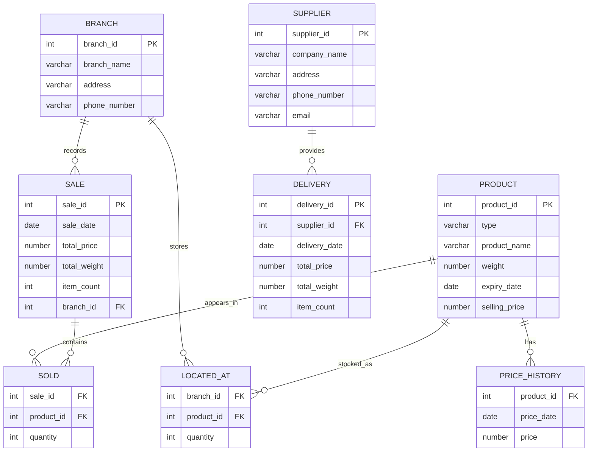

# IDS / Database Systems

Oracle SQL/PLSQL relational database project with joins, triggers, stored procedures, indexing and materialized views.

## What this project demonstrates

- Relational database design with primary and foreign keys
- Data integrity with `NOT NULL`, `CHECK` and composite constraints
- Multi-table `JOIN` queries
- Aggregation with `SUM` and `GROUP BY`
- Nested queries, `EXISTS`, `NOT IN`, CTEs and `CASE`
- PL/SQL triggers and stored procedures
- Explicit cursors, `%TYPE`, record types and exception handling
- Index creation and `EXPLAIN PLAN`
- Privilege management with `GRANT`
- Materialized views

## Domain model

The database contains the following main entities:

- `Branch` — retail locations
- `Product` — fruits and vegetables sold by the branches
- `Supplier` — companies delivering products
- `Delivery` — supplier deliveries
- `Sale` — sales recorded by branch
- `Sold` — products included in each sale
- `Located_At` — current stock per branch and product
- `Price_History` — product price changes over time



## Documentation

The original project documentation with the use-case diagram and database model is available in [`docs/database-design.pdf`](docs/database-design.pdf).

## Repository structure

```text
.
├── README.md
├── docs/
│   └── database-design.pdf
└── xfedor14_xramas01.sql   # original university project file
```

## How to run

The project is written for Oracle Database / Oracle SQL Developer.

Run `xfedor14_xramas01.sql` as the main project script. `SET SERVEROUTPUT ON` may be enabled in Oracle SQL Developer to display output from PL/SQL procedures.

## Notes

This coursework was completed as a team project. The original SQL file is preserved unchanged in this repository.
