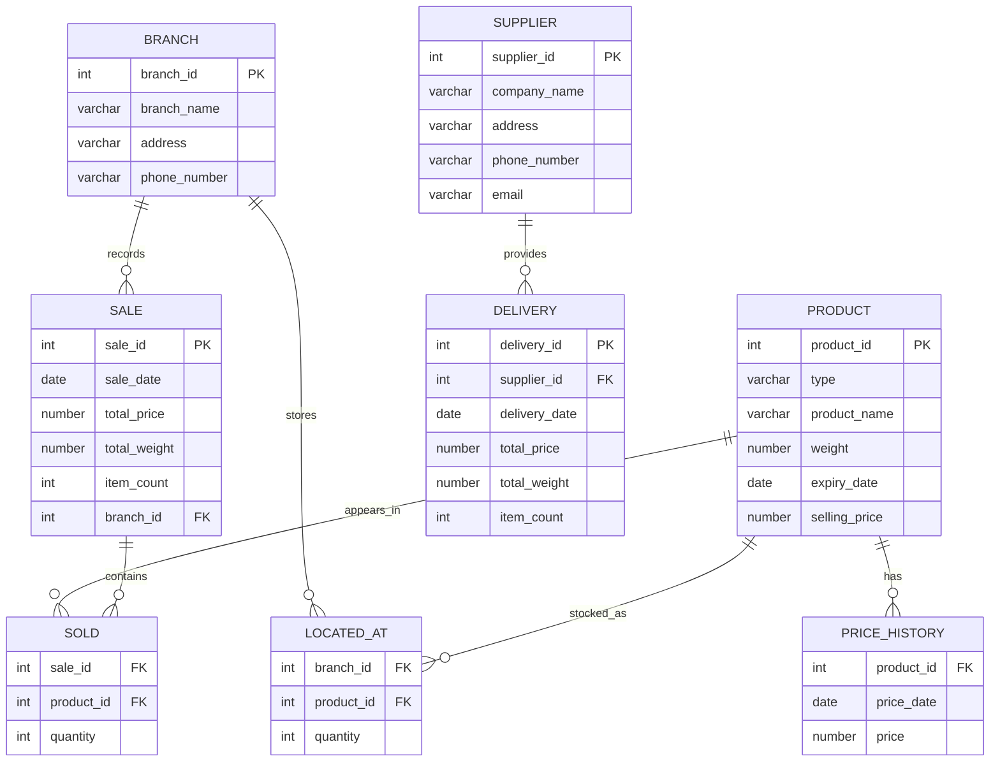

# IDS / Database Systems

Oracle SQL/PLSQL relational database project with joins, triggers, stored procedures, indexing and materialized views.

## What this project demonstrates

- Relational database design with primary and foreign keys
- Data integrity with `NOT NULL`, `CHECK` and composite constraints
- Multi-table `JOIN` queries
- Aggregation with `SUM` and `GROUP BY`
- Nested queries, `EXISTS`, `NOT IN`, CTEs and `CASE`
- PL/SQL triggers and stored procedures
- Explicit cursors, `%TYPE`, record types and exception handling
- Index creation and `EXPLAIN PLAN`
- Privilege management with `GRANT`
- Materialized views

## Domain model

The database contains the following main entities:

- `Branch` — retail locations
- `Product` — fruits and vegetables sold by the branches
- `Supplier` — companies delivering products
- `Delivery` — supplier deliveries
- `Sale` — sales recorded by branch
- `Sold` — products included in each sale
- `Located_At` — current stock per branch and product
- `Price_History` — product price changes over time



## Repository structure

```text
.
├── README.md
├── sql/
│   ├── 01_schema.sql
│   ├── 02_sample_data.sql
│   ├── 03_queries.sql
│   ├── 04_plsql.sql
│   └── 05_performance_and_views.sql
└── xfedor14_xramas01.sql   # original university submission
```

## How to run

The scripts are written for Oracle Database / Oracle SQL Developer.

Run them in this order:

1. `sql/01_schema.sql`
2. `sql/02_sample_data.sql`
3. `sql/03_queries.sql`
4. `sql/04_plsql.sql`
5. `sql/05_performance_and_views.sql`

`SET SERVEROUTPUT ON` is required to see output from the PL/SQL procedures.

## Notes

The original coursework was completed as a team project by **Tatiana Fedorova** and **Jakub Ramašeuski**. The original submitted file is kept in the repository. The files under `sql/` reorganize and clean the project for readability and portfolio presentation while keeping the same database concepts and functionality.

## Skills demonstrated

`Oracle SQL` · `PL/SQL` · `Relational Databases` · `Joins` · `Subqueries` · `CTEs` · `Triggers` · `Stored Procedures` · `Indexes` · `EXPLAIN PLAN` · `Materialized Views`
